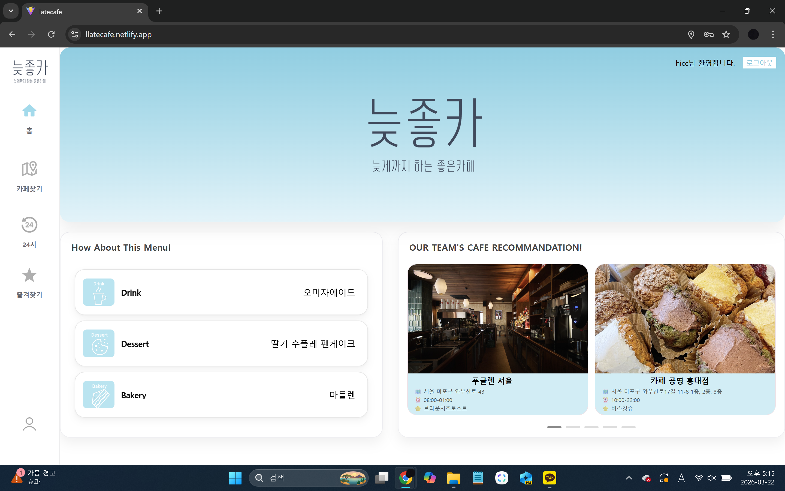
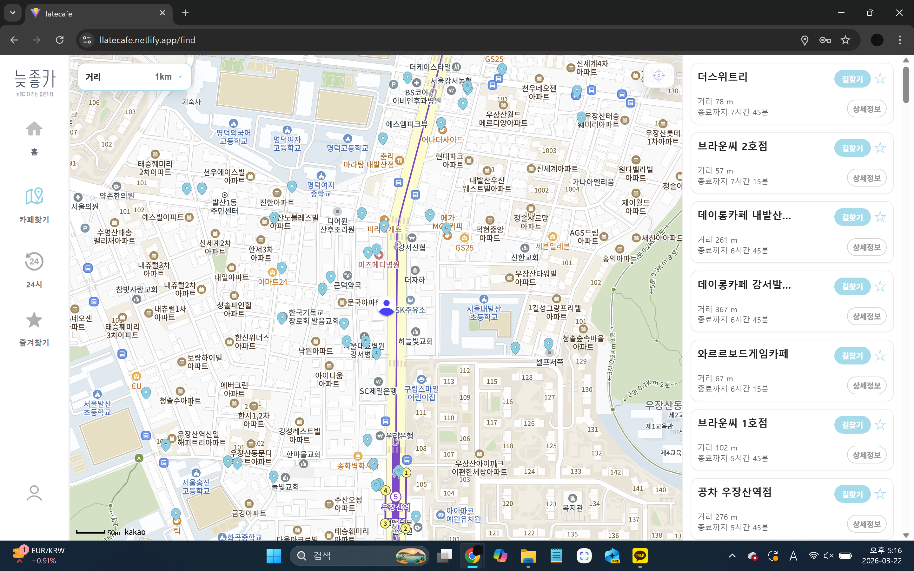
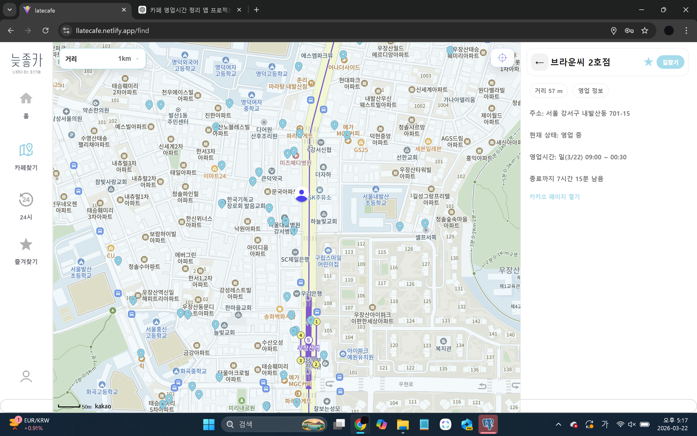
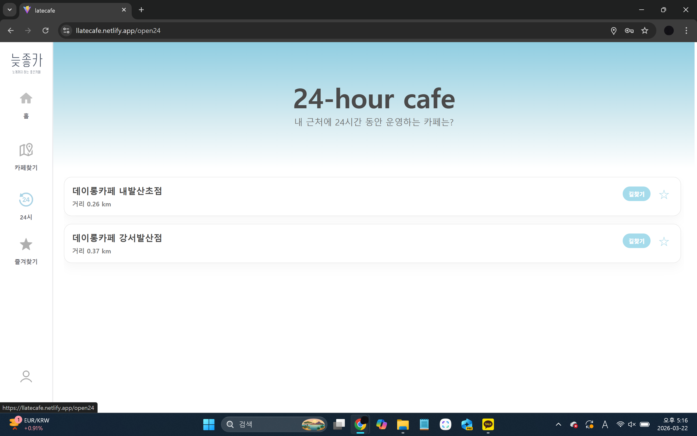
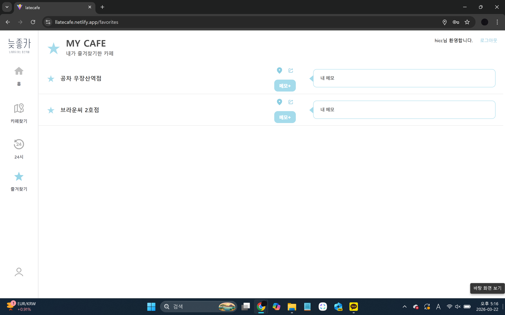
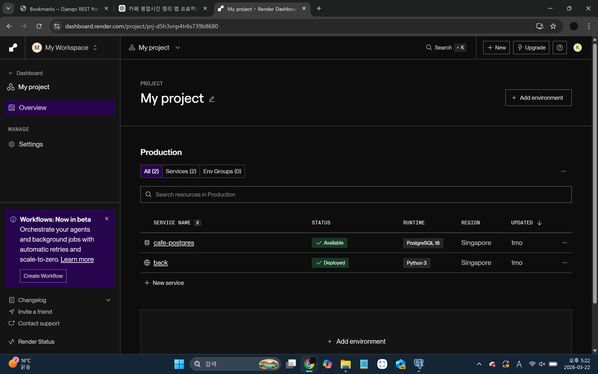
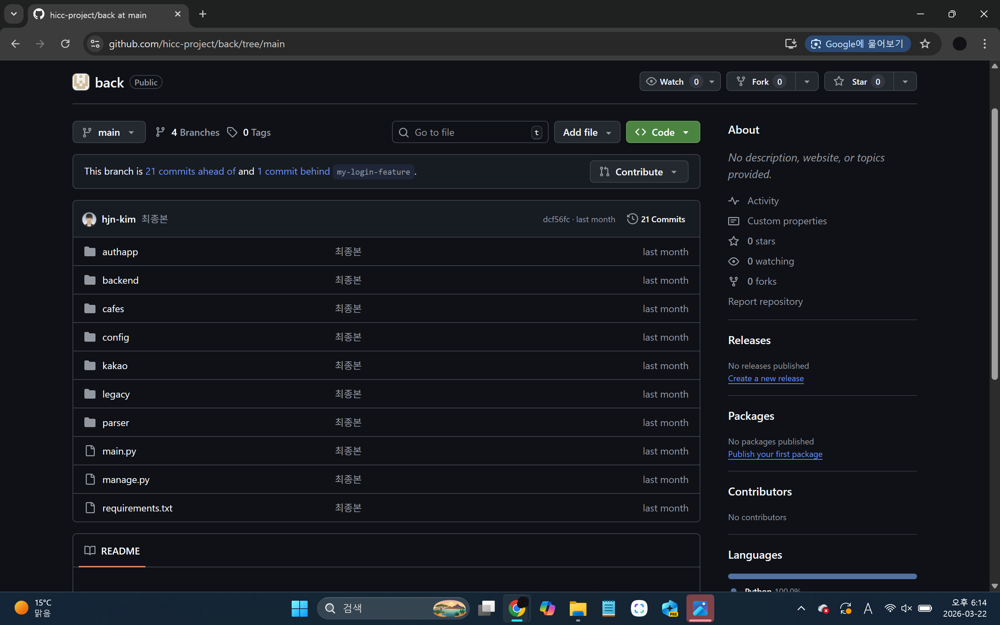

# ☕ LateCafe

> **늦은 시간에도 운영 중인 카페를 쉽게 찾을 수 있는 위치 기반 카페 검색 서비스**

LateCafe는 사용자의 현재 위치를 기반으로 주변 카페를 검색하고,
실시간 영업 여부와 마감까지 남은 시간을 제공하는 웹 서비스입니다.

또한 24시간 운영 카페 검색과 즐겨찾기 기능을 제공하여
사용자가 원하는 카페를 보다 편리하게 찾을 수 있도록 구현했습니다.

---

# 👨‍💻 담당 역할

> 본 프로젝트는 **팀 프로젝트**이며, 저는 **Backend 개발**을 담당했습니다.

### 담당 업무

- Django Backend 개발
- Django REST Framework 기반 REST API 개발
- PostgreSQL 데이터베이스 설계
- Kakao Local API 연동
- 카페 데이터 수집 및 저장
- 영업시간 파싱 및 데이터 정규화
- 현재 영업 여부 계산 로직 구현
- 마감까지 남은 시간 계산
- 24시간 운영 카페 판별 로직 구현
- Render를 활용한 Backend 및 PostgreSQL 배포

---

# 🛠 Tech Stack

## Backend

- Python
- Django
- Django REST Framework

## Database

- PostgreSQL

## Frontend

- React
- CSS
- Kakao Map API

## Deployment

- Render
- Netlify

## Version Control

- Git
- GitHub

---

# ✨ 주요 기능

## 📍 위치 기반 카페 검색

- 현재 위치 기준 주변 카페 검색
- 현재 영업 여부 표시
- 마감까지 남은 시간 제공
- 마감까지 남은 시간이 긴 순으로 정렬

---

## ☕ 카페 상세 조회

- 오늘의 영업시간 조회
- 현재 영업 상태 표시
- 마감까지 남은 시간 계산
- 카카오맵 상세 페이지 연결

---

## 🌙 24시간 카페 검색

- 24시간 운영 중인 카페만 조회

---

## ⭐ 즐겨찾기

- 즐겨찾기 등록 및 삭제
- 개인 메모 저장

---

# 📷 서비스 화면

## 메인 화면

---

## 위치 기반 카페 검색

---

## 카페 상세 조회

---

## 24시간 카페 검색

---

## 즐겨찾기

---

# 🏗 시스템 아키텍처

---

# 🗄 데이터베이스 설계

---

# 💡 핵심 구현 내용

## 영업 여부 계산

카페별 영업시간을 파싱한 뒤,
현재 요일과 시간을 기준으로 영업 여부를 계산하도록 구현했습니다.

---

## 마감까지 남은 시간 계산

영업 마감 시각과 현재 시각을 비교하여
사용자에게 마감까지 남은 시간을 제공합니다.

---

## 24시간 카페 판별

영업시간 데이터를 기반으로
24시간 운영 카페를 판별하는 로직을 구현했습니다.

---

## 위치 기반 카페 검색 및 정렬

사용자의 현재 위치를 기준으로 주변 카페를 조회하고,
각 카페의 현재 영업 상태와 마감까지 남은 시간을 계산했습니다.

조회 결과는 마감까지 남은 시간이 긴 카페부터 확인할 수 있도록 정렬했습니다.

---

# 🚀 배포 환경

- **Backend:** Render
- **Database:** PostgreSQL on Render
- **Frontend:** Netlify

---

## Render 배포

---

# 📂 Repository Structure

---

# ⚠ Troubleshooting

## 카페별 영업시간 형식 차이로 인한 영업 상태 계산

### Problem

카페마다 요일별 영업시간이 달라
현재 영업 여부와 마감까지 남은 시간을 일관된 방식으로 계산하기 어려웠습니다.

### Solution

현재 요일의 영업시간을 조회한 뒤,
현재 시간과 비교하여 영업 여부를 계산하도록 구현했습니다.

영업 중인 경우에는 마감 시각과 현재 시각의 차이를 계산하여
마감까지 남은 시간을 제공했으며,
영업시간 정보가 없는 경우에는 `null` 값을 반환하도록 처리했습니다.

---

# 📚 프로젝트를 통해 배운 점

이번 프로젝트를 통해

- Django 기반 REST API 개발
- PostgreSQL 데이터베이스 설계
- 위치 기반 서비스(LBS) 개발
- REST API 기반 Frontend-Backend 협업
- Render를 활용한 웹 서비스 배포

를 경험할 수 있었습니다.

특히 영업시간 데이터를 처리하고
현재 영업 여부와 마감까지 남은 시간을 계산하는 로직을 구현하면서
단순 CRUD를 넘어 비즈니스 로직을 설계하는 경험을 할 수 있었습니다.
